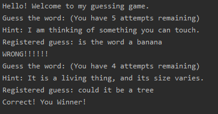

<h1> Guessing game </h1>

<b> The guessing game selects a word from a text file, and prompts the user to guess it. The user has five
 guesses, and a hint is provided to the user after each guess. The game uses python's speech recognition to
 receive the guess from the user, and uses text to speech to respond with prompts. </b>

 The game was made for the Assistant project currently still a WIP
 <h2> Example game </h2>
 
